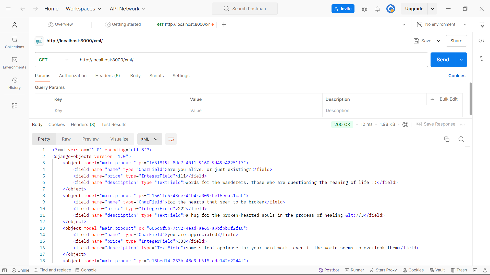
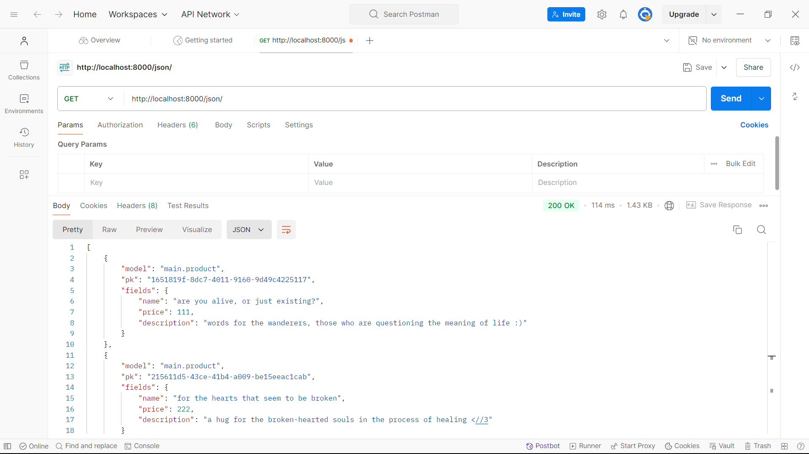
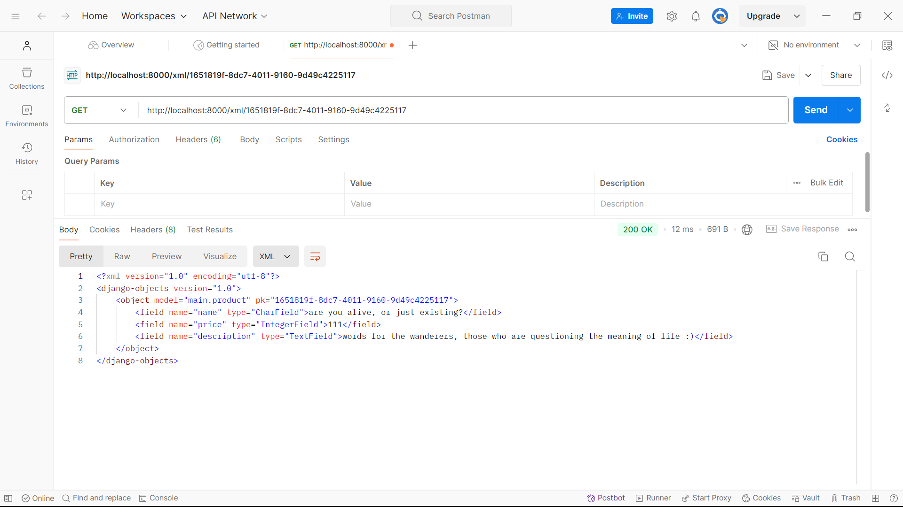
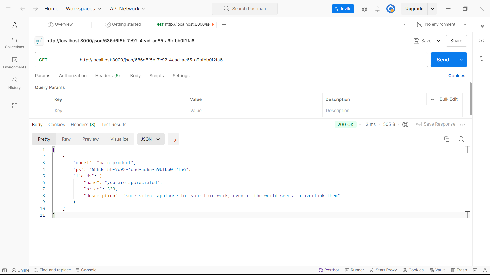

# [The Deployment Link: Words of Affir-MACHINE](http://haliza-nafiah-wordsofaffirmachine.pbp.cs.ui.ac.id/)

---

# Tugas 2: Implementasi Model-View-Template (MVT) pada Django
## Implementasi checklist step-by-step
1. **Membuat proyek Django baru**: Pada awalnya, saya membuat direktori dengan nama proyek baru secara lokal. Selanjutnya, saya membuat file _requirements.txt_ yang berisi hal-hal yang akan diinstal. Melalui Command Prompt, saya masuk ke virtual environment pada direktori tadi kemudian menginstal requirements. Setelah sudah terinstal, saya menjalankan command untuk membuat project Django. Pengecekan apabila project Django sudah dibuat dilakukan pada localhost:8000.

2. **Membuat aplikasi dengan nama main pada proyek tersebut**: Setelah project Django dibuat, akan ada file manage.py. Saya jalankan command "_python manage.py startapp main_" sehingga dibuatlah direktori aplikasi bernama _main_. Kemudian, pada file _settings.py_ yang ada di direktori utama, saya menambahkan "main" ke dalam list INSTALLED_APPS.

3. **Melakukan routing pada proyek agar dapat menjalankan aplikasi main**: Saya membuat file _urls.py_ berisi nama aplikasi "main" beserta list urlpatterns dalam direktori aplikasi. Kemudian, pada file _urls.py_ yang ada pada direktori proyek, saya menambahkan file _urls.py_ dari direktori aplikasi ke list urlpatterns yang ada di dalamnya.

4. **Membuat model pada aplikasi main dengan nama Product dan memiliki atribut wajib name, price, description**: Pada file _models.py_ yang ada di direktori aplikasi, saya membuat class model Product dan menambahkan atribut CharField name, IntegerField price, serta TextField description. Atribut wajib ini akan dimunculkan pada aplikasi saya, dan nantinya bila saya akan menambahkan atribut lain, maka saya akan menambahkannya pada _models.py_ kembali. 

5. **Membuat sebuah fungsi pada views.py untuk dikembalikan ke dalam sebuah template HTML yang menampilkan nama aplikasi serta nama dan kelas kamu**: Pada file _views.py_ yang ada di direktori aplikasi, saya membuat fungsi _show_main_ yang memiliki dictionary _content_ dengan key dan value dari nama aplikasi, nama, serta kelas saya.

6. **Membuat sebuah routing pada urls.py aplikasi main untuk memetakan fungsi yang telah dibuat pada views.py**: Pada file _urls.py_ dalam direktori main, saya menambahkan "path('', include('main.urls'))," ke list urlpatterns sehingga akan diarahkan ke main ketika membuka URL

7. **Melakukan deployment ke PWS terhadap aplikasi yang sudah dibuat sehingga nantinya dapat diakses oleh teman-temanmu melalui Internet**: Pada PWS, saya membuat project baru dengan nama wordsofaffirmachine sehingga terbentuk URL "haliza-nafiah-wordsofaffirmachine.pbp.cs.ui.ac.id" yang selanjutnya saya tambahkan ke list _ALLOWED_HOSTS_ pada file _settings.py_ yang ada di direktori proyek. Selanjutnya, saya  mengimplementasi MVT dengan memodifikasi file-file sesuai tutorial. Setelah itu, saya melakukan add, commit, dan push ke Github baru kemudian melakukan push ke PWS sehingga proyek saya tidak hanya bisa dibuka pada localhost, tetapi juga pada internet.

## Bagan request client

Pertama, Client mengirim request melalui Browser. Kemudian, request tersebut diproses _urls.py_, yang menentukan view mana yang akan digunakan. Setelah itu, kode dalam _views.py_ dijalankan. Jika terdapat data yang diperlukan maka view akan mengambil data dari _models.py_. Setelah data terkumpul, _main.html_ akan dirender dengan template dan data tersebut. Kemudian, hasil berupa website akan dikembalikan ke Browser dari Client.

## Fungsi git dalam pengembangan perangkat lunak
Fungsi git adalah sebagai tempat penyimpanan perubahan yang terjadi serta versi-versi dari suatu proyek. Dengan adanya "archive" versi ini, apabila di tengah terjadi masalah, dapat diambil dan digunakan lagi versi sebelum terjadinya perubahan. Selain itu, git memungkinkan kolaborasi antar orang-orang yang mengerjakan suatu proyek, dengan sistem branching yang memungkinkan kode menjadi terorganisasi.

## Mengapa framework Django?
Karena Django mengikuti pola Models-Views-Template (MVT) sehingga memungkinkan pemula memahami cara kerja pengembangan perangkat lunak. Django juga memiliki fitur-fitur yang dapat dengan mudah digunakan dan dikembangkan untuk membangun aplikasi. Selain itu, Django menggunakan bahasa pemrograman Python yang memiliki readability tinggi dan straight-forward. Dengan begitu, pemula dapat dengan mudah memahami struktur kode-kode pada pembuatan aplikasi dengan Django.

## Mengapa model pada Django disebut sebagai ORM?
ORM artinya Object Relational Mapping, yakni teknik menghubungkan antara tabel pada database dengan objek. Pada Django, model merupakan objek-objeknya. Setiap kali dilakukan perubahan pada model, dilakukan pula migrasi untuk memperbarui database mengikuti perubahan yang terjadi. Hal inilah yang disebut dengan ORM, yakni berupa jembatan antara tabel database dengan model pada Django. 

---

# Tugas 3: Implementasi Form dan Data Delivery pada Django
## Mengapa diperlukan data delivery dalam pengimplementasian sebuah platform?
Data delivery diperlukan karena terjadinya perpindahan informasi atau data antar bagian dalam sistem, misalnya dari server ke client ataupun sebaliknya. Implementasi data delivery memastikan bahwa terjadi integrasi antar bagian-bagian sistem sehingga data berpindah sesuai yang seharusnya.
 
## Mana yang lebih baik antara XML dan JSON? Mengapa JSON lebih populer dibandingkan XML?
Menurut saya, JSON lebih baik. Hal ini terbukti dari kepopuleran JSON yang melebihi XML, alasan utamanya adalah karena JSON lebih sederhana dan memiliki _readability_ tinggi. Karena sifatnya yang _compact_, ia lebih fleksibel dan cenderung mudah untuk dilakukan _parsing_.

## Fungsi dari method ```is_valid()``` pada form Django dan mengapa dibutuhkannya method tersebut
Method ```is_valid()``` memastikan bahwa semua field pada form Django telah terisi dengan data yang sesuai sebelum berlanjut ke proses berikutnya. Tanpa method ini, program akan terus berjalan meski field pada form kosong, sehingga dapat menyebabkan kesalahan pemrosesan.

## Mengapa dibutuhkan ```csrf_token``` saat membuat form di Django? Apa yang dapat terjadi ```csrf_token``` pada form Django tidak ditambahkan? Bagaimana hal tersebut dapat dimanfaatkan oleh penyerang?
```csrf_token``` dibutuhkan sebagai langkah keamanan untuk memastikan bahwa tidak sembarang orang dapat mengakses form karena token bersifat unik. Tanpa ```csrf_token```, siapapun dapat membuat form palsu dan tidak ada cara untuk memverifikasi bahwa request tersebut berasal dari seseorang yang benar. Hal ini dapat dimanfaatkan penyerang untuk melakukan hal-hal dengan mengatasnamakan orang lain, terutama jika web terkait melibatkan informasi penting seperti transaksi pada bank.

## Implementasi checklist step-by-step
1. **Membuat input form untuk menambahkan objek model pada app sebelumnya.**: Pada proses ini, saya membuat file ```forms.py``` pada direktori main yang isinya class untuk menerima form data Product baru. Selanjutnya, saya meng-import class tersebut ke ```views.py``` dan membuat fungsi yang menerima parameter request di situ. Fungsi inilah yang digunakan untuk memvalidasi dan menerima form data baru. 

2. **Tambahkan 4 fungsi views baru untuk melihat objek yang sudah ditambahkan dalam format XML, JSON, XML by ID, dan JSON by ID.**: Pada ```views.py```, saya menambahkan 4 fungsi baru yakni ```show_xml``` dan ```show_json``` yang menerima parameter _request_, serta ```show_xml_by_id``` dan ```show_json_by_id``` yang menerima parameter _request, id_. Kedua fungsi ini akan menampilkan data dari entri Product dalam bentuk XML/JSON masing-masing. Parameter ID ditambahkan sehingga memungkinkan untuk menampilkan hanya entri tertentu saja berdasarkan ID yang telah di-generate.

3. **Membuat routing URL untuk masing-masing views yang telah ditambahkan pada poin 2.**: Pada ```urls.py```, saya melakukan import fungsi-fungsi yang telah dibuat pada poin 2. Selanjutnya, saya menambahkan path URL ke list ```urlpatterns``` yang ada pada file tersebut. Path url yang ditambahkan terdiri dari 4, yang masing-masing berkorespondensi dengan tiap fungsi sebelumnya. Misalnya, path ```'xml/'``` akan mengarah ke fungsi ```show_xml```, dan path ```'json/<str:id>/'``` akan mengarah ke fungsi ```show_json_by_id```.

## Screenshot hasil masing-masing URL pada Postman
1. http://localhost:8000/xml/

2. http://localhost:8000/json/

3. http://localhost:8000/xml/1651819f-8dc7-4011-9160-9d49c4225117

4. http://localhost:8000/json/686d6f5b-7c92-4ead-ae65-a9bfbb0f2fa6

